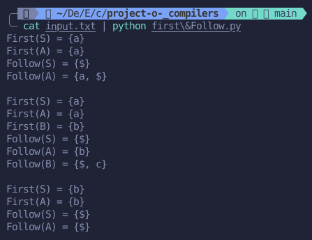

# Languages ​​and compilers project

[](https://classroom.github.com/a/_TptmXl2)


## Screenshot

With test case from `input.txt` this is the result.




## Full names

- Juan Andrés Young Hoyos
- Samuel Enrique Rivero Urribarrí
- Emanuel Ossa Osorio

## Versions

- Python Version: Python 3.12.2
Tested on
- Windows 11.
- Pop!_OS 22.04 LTS x86_64.
- Kernel: 6.9.3-76060903-generic

## Detailed Instructions

Detailed Instructions for Running the Implementation (The repository includes a virtual environment for best practices, but it is unnecessary to run the `main.py` code). To run the implementation, follow these steps:

1. **Clone the repository**
   - Clone the repository using the following command:
     ```bash
        git clone repositoryURLorUseSSH
     ```
2. Use the following commands to run the code:
  ```bash
    # If you are using Windows use this command
     # In cmd terminal:
        python main.py < input.txt
     # In powershell terminal:
        Get-Content input.txt | python main.py
    # If you are on Linux or any OS X machine use this line
    python3 main.py < input.txt
  ```

Or you can use a virtual environment if you want to use a formatter like black:
  ```bash
    python3 -m venv venv
    source venv/bin/activate
    pip install -r requirements.txt
    python app/main.py
  ```
**Or you can run `main.py` writing manually every input(only if the above doesn't work)**
  ```bash
    # If you are using Windows use this command
    python main.py
    # If you are on Linux or any OS X machine use this line
    python3 main.py
  ```
    